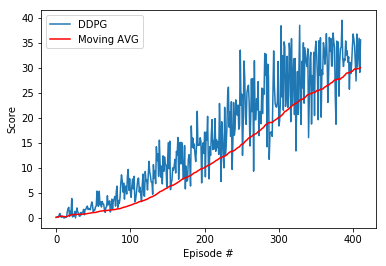

# Continuous Control

---

You are welcome to use this coding environment to train your agent for the project.  Follow the instructions below to get started!

### 1. Start the Environment

Run the next code cell to install a few packages.  This line will take a few minutes to run!


```python
!pip -q install ./python
```

    tensorflow 1.7.1 has requirement numpy>=1.13.3, but you'll have numpy 1.12.1 which is incompatible.
    ipython 6.5.0 has requirement prompt-toolkit<2.0.0,>=1.0.15, but you'll have prompt-toolkit 2.0.10 which is incompatible.


The environments corresponding to both versions of the environment are already saved in the Workspace and can be accessed at the file paths provided below.  

Please select one of the two options below for loading the environment.


```python
from unityagents import UnityEnvironment
import numpy as np

# select this option to load version 1 (with a single agent) of the environment
env = UnityEnvironment(file_name='/data/Reacher_One_Linux_NoVis/Reacher_One_Linux_NoVis.x86_64')

# select this option to load version 2 (with 20 agents) of the environment
# env = UnityEnvironment(file_name='/data/Reacher_Linux_NoVis/Reacher.x86_64')
```

    INFO:unityagents:
    'Academy' started successfully!
    Unity Academy name: Academy
            Number of Brains: 1
            Number of External Brains : 1
            Lesson number : 0
            Reset Parameters :
    		goal_speed -> 1.0
    		goal_size -> 5.0
    Unity brain name: ReacherBrain
            Number of Visual Observations (per agent): 0
            Vector Observation space type: continuous
            Vector Observation space size (per agent): 33
            Number of stacked Vector Observation: 1
            Vector Action space type: continuous
            Vector Action space size (per agent): 4
            Vector Action descriptions: , , , 


Environments contain **_brains_** which are responsible for deciding the actions of their associated agents. Here we check for the first brain available, and set it as the default brain we will be controlling from Python.


```python
# get the default brain
brain_name = env.brain_names[0]
brain = env.brains[brain_name]
```

### 2. Examine the State and Action Spaces

Run the code cell below to print some information about the environment.


```python
# reset the environment
env_info = env.reset(train_mode=True)[brain_name]

# number of agents
num_agents = len(env_info.agents)
print('Number of agents:', num_agents)

# size of each action
action_size = brain.vector_action_space_size
print('Size of each action:', action_size)

# examine the state space 
states = env_info.vector_observations
state_size = states.shape[1]
print('There are {} agents. Each observes a state with length: {}'.format(states.shape[0], state_size))
print('The state for the first agent looks like:', states[0])
```

    Number of agents: 1
    Size of each action: 4
    There are 1 agents. Each observes a state with length: 33
    The state for the first agent looks like: [  0.00000000e+00  -4.00000000e+00   0.00000000e+00   1.00000000e+00
      -0.00000000e+00  -0.00000000e+00  -4.37113883e-08   0.00000000e+00
       0.00000000e+00   0.00000000e+00   0.00000000e+00   0.00000000e+00
       0.00000000e+00   0.00000000e+00  -1.00000000e+01   0.00000000e+00
       1.00000000e+00  -0.00000000e+00  -0.00000000e+00  -4.37113883e-08
       0.00000000e+00   0.00000000e+00   0.00000000e+00   0.00000000e+00
       0.00000000e+00   0.00000000e+00   5.75471878e+00  -1.00000000e+00
       5.55726671e+00   0.00000000e+00   1.00000000e+00   0.00000000e+00
      -1.68164849e-01]


### 3. Take Random Actions in the Environment

In the next code cell, you will learn how to use the Python API to control the agent and receive feedback from the environment.

Note that **in this coding environment, you will not be able to watch the agents while they are training**, and you should set `train_mode=True` to restart the environment.


```python
env_info = env.reset(train_mode=True)[brain_name]      # reset the environment    
states = env_info.vector_observations                  # get the current state (for each agent)
scores = np.zeros(num_agents)                          # initialize the score (for each agent)
while True:
    actions = np.random.randn(num_agents, action_size) # select an action (for each agent)
    actions = np.clip(actions, -1, 1)                  # all actions between -1 and 1
    env_info = env.step(actions)[brain_name]           # send all actions to tne environment
    next_states = env_info.vector_observations         # get next state (for each agent)
    rewards = env_info.rewards                         # get reward (for each agent)
    dones = env_info.local_done                        # see if episode finished
    scores += env_info.rewards                         # update the score (for each agent)
    states = next_states                               # roll over states to next time step
    if np.any(dones):                                  # exit loop if episode finished
        break
print('Total score (averaged over agents) this episode: {}'.format(np.mean(scores)))
```

    Total score (averaged over agents) this episode: 0.0


When finished, you can close the environment.


```python
# env.close()
```

### 4. It's Your Turn!

Now it's your turn to train your own agent to solve the environment!  A few **important notes**:
- When training the environment, set `train_mode=True`, so that the line for resetting the environment looks like the following:
```python
env_info = env.reset(train_mode=True)[brain_name]
```
- To structure your work, you're welcome to work directly in this Jupyter notebook, or you might like to start over with a new file!  You can see the list of files in the workspace by clicking on **_Jupyter_** in the top left corner of the notebook.
- In this coding environment, you will not be able to watch the agents while they are training.  However, **_after training the agents_**, you can download the saved model weights to watch the agents on your own machine! 


```python
import matplotlib.pyplot as plt
%matplotlib inline

import numpy as np
import random
import time
import torch

from collections import deque
from workspace_utils import active_session
from ddpgAgent import Agent
from unityagents import UnityEnvironment
```


```python
seed = 5
```

### HyperParameters

- BUFFER_SIZE = int(3e5) &emsp;  # Replay buffer size
- BATCH_SIZE = 128     &emsp;    #minibatch size
- GAMMA = 0.99       &emsp;      #discount factor

- TAU = 1e-3       &emsp;        #for soft update of target parameters from ddpg
- LR_ACTOR = 2e-4     &emsp;     #learning rate of the actor started at 1e-4 and varied
- LR_CRITIC = 2e-4    &emsp;     #learning rate of the critic started at 1e-4 and varied
- WEIGHT_DECAY = 0   &emsp;      #L2 weight decay
- EPSILON = 1.0        &emsp;    # for epsilon in the noise process (act step)
- EPSILON_DECAY = 1e-6

Suggested on slack:
- LEARN_EVERY = 20 &emsp; # learning timestep interval
- LEARN_NUM = 10 &emsp; # number of learning passes
- GRAD_CLIPPING = 1.0  &emsp; # Gradient Clipping

Ornstein-Uhlenbeck noise parameters
- OU_SIGMA = 0.02
- OU_THETA = 0.1


### Model Architecture

The Agent using policy — based approach is learning to act (agent learns by interacting with environment and adjusts the probabilities of good and bad actions, while in a value-based approach, the agent is learning to estimate states and actions.). In parallel we use a Critic, which is to be able to evaluate the quality of actions more quickly (proper action or not) and speed up learning. Actor-critic method is more stable than value — based agents, while requiring fewer training samples than policy-based agents.

The Actor follows the policy-based approach, and learns how to act by directly estimating the optimal policy and maximizing reward through gradient ascent. The Critic however, utilizes the value-based approach and learns how to estimate the value of different state — action pairs.

As a result of merge Actor — Critic we utilize two separate neural networks. The role of the Actor network is to determine the best actions (from probability distribution) in the state by tuning the parameter θ (weights). The Critic by computing the temporal difference error TD (estimating expected returns), evaluates the action generated by the Actor.

class Actor(nn.Module):
    
    def __init__(self, state_size, action_size, seed):
        super(Actor,self).__init__()
        self.seed = torch.manual_seed(seed)
        
        self.fc1 = nn.Linear(state_size, 500)
        self.bn1 = nn.BatchNorm1d(500)
        self.fc2 = nn.Linear(500, 300)
        self.fc3 = nn.Linear(300, action_size)
        self.reset_parameters()
        
    def reset_parameters(self):
        self.fc1.weight.data.uniform_(*hidden_init(self.fc1))
        self.fc2.weight.data.uniform_(*hidden_init(self.fc2))
        self.fc3.weight.data.uniform_(-3e-3, 3e-3)
    
    def forward(self,x):
        x = F.relu(self.bn1(self.fc1(x)))
        x = F.relu(self.fc2(x))
        return torch.tanh(self.fc3(x))

    
class Critic(nn.Module):
    
    def __init__(self, state_size, action_size,seed):
        
        super(Critic, self).__init__()
        self.seed = torch.manual_seed(seed)
        
        self.fc1 = nn.Linear(state_size, 500)
        self.bn1 = nn.BatchNorm1d(500)
        self.fc2 = nn.Linear(500 + action_size,300)
        self.fc3 = nn.Linear(300, 1)
        self.reset_parameters()
    
    def reset_parameters(self):
        self.fc1.weight.data.uniform_(*hidden_init(self.fc1))
        self.fc2.weight.data.uniform_(*hidden_init(self.fc2))
        self.fc3.weight.data.uniform_(-3e-3, 3e-3)
    
    def forward(self,state, action):
        x_state = F.relu(self.bn1(self.fc1(state)))
        x = torch.cat((x_state, action), dim=1)
        x = F.relu(self.fc2(x))
        return self.fc3(x)
        


```python
# DDPG Function

def ddpg(n_episodes = 2500, max_t = 1000, print_every = 10):
    
    mean_scores = []
    moving_avgs = []
    best_score = -np.inf
    scores_window = deque(maxlen=100)
    
    
    for i_episode in range(1, n_episodes+1):
        env_info = env.reset(train_mode= True)[brain_name]
        states = env_info.vector_observations
        scores = np.zeros(num_agents)
        agent.reset()
        start_time = time.time()
        for t in range(max_t):
            actions = agent.act(states, add_noise=True)
            env_info = env.step(actions)[brain_name]
            next_states = env_info.vector_observations
            rewards = env_info.rewards
            dones = env_info.local_done
            
            for state, action, reward, next_state, done in zip(states, actions, rewards, next_states, dones):
                agent.step(state,action,reward, next_state,done,t)
            states = next_states
            scores += rewards
            if np.any(dones):
                break
        duration = time.time() - start_time
        mean_scores.append(np.mean(scores))
        scores_window.append(mean_scores[-1])
        moving_avgs.append(np.mean(scores_window))
        
        if i_episode % print_every == 0:
            print('\rEpisode {} ({}s)\tMean: {:.1f}\tMoving Avg: {:.1f}'.format(\
                  i_episode, round(duration), mean_scores[-1], moving_avgs[-1]))
                  
        if moving_avgs[-1] >= 30.00 and i_episode >= 100:
            print('\nEnvironment solved in {:d} episodes!\tAverage Score: {:.2f}'.format(i_episode-100, moving_avgs[-1]))            
            break
        
    return mean_scores, moving_avgs
```


```python
state = time.time()
```


```python
agent = Agent(state_size = state_size, action_size = action_size, seed = seed)
with active_session():
    scores, avgs = ddpg()
```

    Episode 10 (9s)	Mean: 0.2	Moving Avg: 0.3
    Episode 20 (9s)	Mean: 1.3	Moving Avg: 0.5
    Episode 30 (9s)	Mean: 1.2	Moving Avg: 0.7
    Episode 40 (9s)	Mean: 1.7	Moving Avg: 0.8
    Episode 50 (9s)	Mean: 2.5	Moving Avg: 1.1
    Episode 60 (9s)	Mean: 2.6	Moving Avg: 1.3
    Episode 70 (9s)	Mean: 4.4	Moving Avg: 1.5
    Episode 80 (9s)	Mean: 4.3	Moving Avg: 1.7
    Episode 90 (9s)	Mean: 7.4	Moving Avg: 2.0
    Episode 100 (9s)	Mean: 7.8	Moving Avg: 2.5
    Episode 110 (9s)	Mean: 6.4	Moving Avg: 3.0
    Episode 120 (9s)	Mean: 4.3	Moving Avg: 3.5
    Episode 130 (9s)	Mean: 7.2	Moving Avg: 4.2
    Episode 140 (9s)	Mean: 15.5	Moving Avg: 5.2
    Episode 150 (9s)	Mean: 6.2	Moving Avg: 5.9
    Episode 160 (9s)	Mean: 10.4	Moving Avg: 6.7
    Episode 170 (9s)	Mean: 15.1	Moving Avg: 7.6
    Episode 180 (9s)	Mean: 12.6	Moving Avg: 8.3
    Episode 190 (9s)	Mean: 14.1	Moving Avg: 9.2
    Episode 200 (9s)	Mean: 12.9	Moving Avg: 10.0
    Episode 210 (9s)	Mean: 16.7	Moving Avg: 10.8
    Episode 220 (9s)	Mean: 12.7	Moving Avg: 11.8
    Episode 230 (9s)	Mean: 14.4	Moving Avg: 12.5
    Episode 240 (9s)	Mean: 23.1	Moving Avg: 13.4
    Episode 250 (9s)	Mean: 22.5	Moving Avg: 14.6
    Episode 260 (9s)	Mean: 26.5	Moving Avg: 15.9
    Episode 270 (9s)	Mean: 19.6	Moving Avg: 16.8
    Episode 280 (10s)	Mean: 25.7	Moving Avg: 18.1
    Episode 290 (10s)	Mean: 17.2	Moving Avg: 19.1
    Episode 300 (9s)	Mean: 31.3	Moving Avg: 20.1
    Episode 310 (10s)	Mean: 22.3	Moving Avg: 21.3
    Episode 320 (10s)	Mean: 28.2	Moving Avg: 22.6
    Episode 330 (10s)	Mean: 22.0	Moving Avg: 23.6
    Episode 340 (10s)	Mean: 33.8	Moving Avg: 24.6
    Episode 350 (10s)	Mean: 33.7	Moving Avg: 25.2
    Episode 360 (10s)	Mean: 28.7	Moving Avg: 25.8
    Episode 370 (10s)	Mean: 33.3	Moving Avg: 26.9
    Episode 380 (10s)	Mean: 27.8	Moving Avg: 27.7
    Episode 390 (10s)	Mean: 31.5	Moving Avg: 28.6
    Episode 400 (10s)	Mean: 34.1	Moving Avg: 29.3
    Episode 410 (10s)	Mean: 29.1	Moving Avg: 29.9
    
    Environment solved in 311 episodes!	Average Score: 30.05


```python
end = time.time()
elapsed = (end - state) / 60.0 # in minutes
print("\nElapsed Time: {0:3.2f} mins.".format(elapsed)) 
```

    
    Elapsed Time: 64.34 mins.


```python
# plot the scores
fig = plt.figure()
ax = fig.add_subplot(111)
plt.plot(np.arange(len(scores)), scores, label='DDPG')
plt.plot(np.arange(len(scores)), avgs, c='r', label='Moving AVG')
plt.ylabel('Score')
plt.xlabel('Episode #')
plt.legend(loc='upper left');
plt.show()
```





```python
env.close()
```


### Ideas for improving the agent's performance¶
- Batch Normalization
- Limit number of episodes
- Deploy the A3C,D4PG algorithms which exploits multiple agents


```python

```
